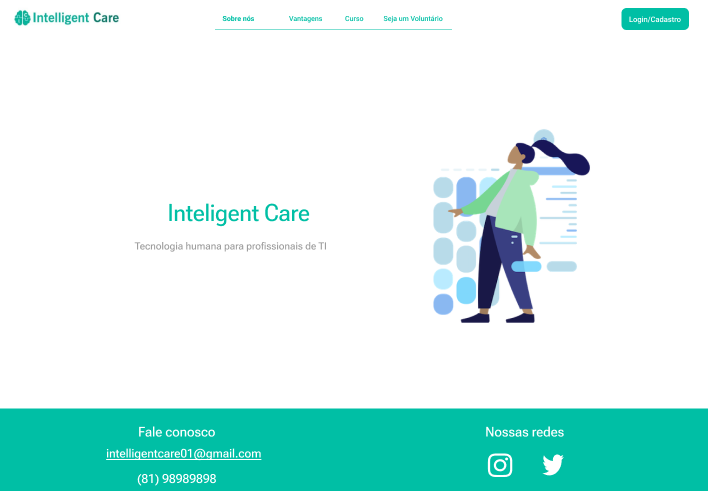
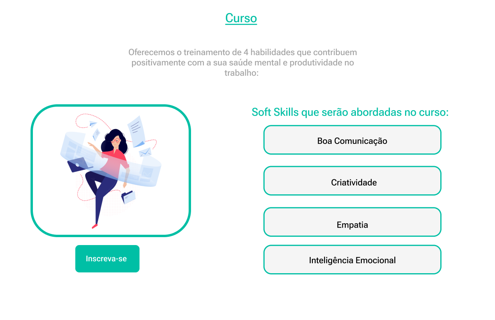

# Projeto Final Reprograma imersão JS
Projeto final com tema livre criado na ultima semana do curso de imersao JS na reprograma

## Intelligente Care

Apesar das universidades de TI prepararem tecnicamente para o mercado de trabalho, sabemos que existem outras habilidades que são negligenciadas durante o processo de amadurecimento profissional, as softSkills.

Com a ideia de facilitar o desenvolvimento de estudantes de psicologia e promover maior bem estar e saúde mental a pessoas estudantes de TI, a inteligente Care propõe um vinculo entre esses estudantes, mediado via orientadores, focando no objetivo de aprimorar as softSiklls dessas pessoas, preparando-as para os diversos ambientes das empresas no mercado de trabalho.

### Contexto Técnico geral

Essa implementação visa simular uma arquitetura de back-end com aplicação de conceitos como SOLID, testes, OOP.

O estudante de TI interessado poderia acessar a plataforma onde veria os cursos disponiveis baseado na habilidade que mais deseja desenvolver. 

O estudante de psicologia, junto ao seu orientador, iria disponibilizar cursos de curta duração onde o aluno poderia se inscrever. 

Inicialmente o projeto teria uma implementação mais manual apenas com a crição de um curso de acordo com seus critérios de aceite e inserção de estudantes interessados no curso disponível.

### Proposta de desenvolvimento inicial para entrega de projeto final Reprograma
- [x] Criação da classe da entidades a serem modeladas
- [x] Criação de estrutura de pastas e arquivos com responsabilidades bem divididas
- [x] Criação de testes aplicados a cada use-case de cada classe criada
- [x] Criação de simulação de banco de dados para a manipulação de dados das clases
- [ ] Criação estrutura de controlers com API

### Implementações das features realizadas
- Criação do Curso 
- Deleção do Curso 
- Cria do aluno 
- Adição estudantes no curso 
- Deleção de estudantes no curso

### Implementações de features futuras
- Login do aluno
- Perfil do Professor
- Aula disponibilizada na propria plataforma 
- Mentorias com pessoas do mercado de trabalho

### Tecnologias utilizadas
1. Typescript
2. Jest
3. Node - ^18
4. Eslint

### Como rodar 
- Baixar projeto na sua máquina
- Para instalar as dependências: npm install 
- Para rodar os testes: npm run test

